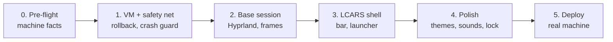

# LCARS Desktop for Ubuntu — Build & Deploy Plan

Sep 23, 2026 · @Steven

## Goal and scope

Build an LCARS-styled desktop session for Ubuntu that works as an everyday computer. It gets built and hardened in a virtual machine first, then installed alongside the current Ubuntu desktop, never replacing it.

**In scope**

- A new login session ("LCARS") selectable at the login screen, next to the existing "Ubuntu" session
- LCARS top bar and sidebar: clock and stardate, workspaces, running apps, system status (CPU, memory, network, battery, volume)
- App launcher, notifications, lock screen, power menu
- LCARS window frames (colored borders, rounded corners) for every app
- Matching GTK and Qt color theme so stock apps blend in
- Interface sounds (button chirps, alerts)
- Rollback tooling that works even if the graphical desktop won't start

**Out of scope (for now)**

- Replacing the login screen (GDM) itself. It stays stock until the session is proven stable.
- Restyling the inside of third-party apps (browsers, Office, games)
- Official Star Trek logos, audio or artwork. Everything is original, in the LCARS style.

## Decisions

Steven confirmed all four decisions on September 23, 2026. The toolkit choice is left to a Phase 1 bake-off.

| Decision | Options | Decision | Why it matters |
| --- | --- | --- | --- |
| Window behavior | Tiling (auto-arranged, keyboard-driven) vs floating (drag freely, like now) | Full tiling on every workspace | Changes keybindings, layout logic and how the sidebar works |
| Shell toolkit | Quickshell (QML) vs AGS/Astal (TypeScript + CSS) | Claude Code decides after prototyping both in the VM | QML handles the curved LCARS shapes and animation well; both are viable |
| Input style | Mouse and keyboard vs touchscreen-first | Keyboard-first | Touch needs larger hit targets and gesture support |
| Sound | On by default vs off by default with a toggle | On, with a mute toggle in the bar | Daily use can make chirps tiresome |

Tiling plus keyboard-first means the bar and sidebar are designed around shortcuts; every LCARS button still works with a mouse click.

## Technical stack

The session runs Hyprland (a Wayland compositor) with a custom LCARS shell on top. All custom code and config lives in one git repo and installs to the user's home folder, not system folders.

| Layer | Component | Role |
| --- | --- | --- |
| Compositor | Hyprland | Draws windows, borders, rounded corners, animations, keybindings |
| Shell | Quickshell (or AGS) | LCARS bar, sidebar, launcher, notifications, OSD popups |
| Lock screen | hyprlock | LCARS-styled lock screen |
| Idle | hypridle | Dims, locks and suspends on idle |
| Wallpaper | hyprpaper | Black or subtle LCARS backdrop |
| App theme | Custom GTK 3/4 + Kvantum (Qt) theme | Recolors stock apps to the LCARS palette |
| Font | Antonio (open-source, Google Fonts) | Tall, condensed, all-caps look |
| Sounds | PipeWire + `pw-play`, original short samples | Interface chirps |
| Login | GDM (unchanged) | Offers "LCARS" and "Ubuntu" sessions |

**Design tokens (starting palette)**

- Background: pure black `#000000`
- Primary: orange `#FF9900`, peach `#FFCC99`
- Secondary: lavender `#CC99CC`, periwinkle `#9999FF`
- Alert: red `#CC6666`
- Text on color: black; text on black: peach

One tokens file feeds the shell, Hyprland borders and the GTK/Qt themes, so a color change updates everything.

## Safety and fallback design

The machine can't be bricked because LCARS is added next to Ubuntu, never in place of it. Every failure has an escape route that doesn't depend on LCARS working.

**Ground rules**

1. **Additive only.** The stock Ubuntu (GNOME) session and GDM login screen are never modified or removed.
2. **User-space install.** Custom files go in `~/.config` and `~/.local` as symlinks into the repo. The only system-level changes are packages installed with `apt` and one session file.
3. **Snapshot first.** A Timeshift system snapshot and a backup of `~/.config` are taken automatically before every deploy.
4. **Nothing auto-starts at boot.** LCARS runs only when chosen at the login screen.

**Escape routes, from mildest to most drastic**

| # | Situation | Escape route |
| --- | --- | --- |
| 1 | Something looks wrong, desktop still responds | Press `Super+Shift+Esc` to exit to the login screen. Pick "Ubuntu" from the gear icon. |
| 2 | LCARS crashes on login | The crash guard (below) starts the stock Ubuntu session instead. |
| 3 | Screen frozen or black | Press `Ctrl+Alt+F3` for a text console, log in, run `lcars-rollback`. |
| 4 | Want LCARS off without removing it | Run `touch ~/.lcars-off` from a console or over SSH. The next login goes to Ubuntu. |
| 5 | System itself is damaged | Restore the pre-deploy Timeshift snapshot from a console, or from a live USB. |

**Crash guard.** LCARS starts through a small wrapper script, `lcars-session`. If `~/.lcars-off` exists, or Hyprland has crashed 3 times within 5 minutes, the wrapper launches the stock Ubuntu session instead and leaves a note explaining why.

**`lcars-rollback` script.** One command that:

- Removes every LCARS symlink and restores the backed-up `~/.config` files
- Sets the default login session back to "Ubuntu"
- Optionally uninstalls the LCARS packages (`--purge`)
- Prints exactly what it changed

All five routes get rehearsed in the virtual machine before deployment. Keep an Ubuntu live USB on hand as the last resort.

## Virtual test environment

Claude Code builds and tests everything in a KVM virtual machine running the same Ubuntu release as Steven's computer. The VM gets rolled back to a clean snapshot whenever a test goes badly.

**VM setup**

- **Host tools:** `qemu-kvm`, `libvirt`, `virt-manager` on Steven's Ubuntu machine
- **Guest:** fresh Ubuntu install, same version as the host, 4 CPU cores, 6 GB RAM, 40 GB disk
- **Graphics:** virtio-gpu with 3D acceleration (virgl) over SPICE. Hyprland needs GPU acceleration, so this is the first thing to prove works.
- **Snapshots:** `clean-install` (fresh Ubuntu) and `pre-deploy` (before each LCARS install), taken with `virsh snapshot-create-as`
- **Access for Claude Code:** SSH into the guest to install, read logs and run commands. Screenshots via `grim` over SSH, so Claude Code can see what the desktop looks like.

**Faster inner loop.** For day-to-day styling work, Hyprland can also run nested as a window inside the current desktop. The VM is for install, login, crash and rollback testing.

**Stability criteria before deploying to the real machine**

- [ ] Install script runs cleanly on a fresh `clean-install` snapshot
- [ ] LCARS session appears at the login screen and starts in under 10 seconds
- [ ] Stock "Ubuntu" session still works, untouched
- [ ] All five escape routes rehearsed and working
- [ ] `lcars-rollback` returns the VM to its pre-install state (checked by comparing `~/.config` before and after)
- [ ] Launcher, notifications, lock, suspend/resume, volume, network and multi-monitor all work
- [ ] 3 days of continuous use in the VM with no crashes in the Hyprland or shell logs
- [ ] Steven has used it hands-on in the VM for at least one session
- [ ] Real-hardware dock test: LCARS started on the laptop itself (Ubuntu session still the default), checked docked with 3 screens, undocked, and while plugging and unplugging the dock

## Phased roadmap

Safety tooling gets built before any styling, so every later phase can be tested against it. Each phase ends with a checkpoint where Steven reviews before the next one starts.



| Phase | Deliverable | Checkpoint |
| --- | --- | --- |
| 0. Pre-flight | Answers to the pre-flight checklist below | Decisions confirmed |
| 1. VM and safety net | Working VM, `install.sh`, `lcars-session` wrapper, `lcars-rollback`, all escape routes proven on a bare Hyprland session | Rollback leaves no trace |
| 2. Base session | Hyprland with LCARS window borders, keybindings, wallpaper, palette tokens | Usable for basic work |
| 3. LCARS shell | Bar, sidebar, launcher, notifications, system readouts | Looks and feels like LCARS |
| 4. Polish | GTK/Qt themes, sounds, lock screen, idle, multi-monitor | Stability criteria all met |
| 5. Deploy | Snapshot, install on the real machine, first week of use | Steven keeps it as daily driver, or rolls back |

After deployment, changes still get tested in the VM first, then deployed with the same snapshot-then-install script.

## Claude Code handoff

Claude Code runs on Steven's Ubuntu machine, works in one git repo, and touches the desktop only through the VM until Phase 5. A `CLAUDE.md` file in the repo holds the rules so every session follows them.

**Repo layout**

```
lcars-desktop/
├── CLAUDE.md              # rules for Claude Code (below)
├── docs/                  # this plan, decisions, test log
├── tokens/palette.json    # single source of colors and fonts
├── hypr/                  # hyprland, hyprlock, hypridle, hyprpaper configs
├── shell/                 # Quickshell (or AGS) LCARS shell
├── themes/                # GTK + Kvantum themes generated from tokens
├── sounds/                # original interface sounds
├── bin/
│   ├── lcars-session      # crash-guard wrapper
│   └── lcars-rollback     # one-command undo
├── install.sh             # snapshot, then install
└── vm/                    # scripts to create, snapshot, reset the test VM
```

**CLAUDE.md rules**

1. Never run `install.sh` or change desktop settings on the host machine. All testing happens in the VM over SSH.
2. Take a VM snapshot before every install test. Restore it after any failed test.
3. Never modify GDM, GNOME, or files under `/etc` beyond what `install.sh` documents.
4. Every change `install.sh` makes must be undone by `lcars-rollback`. Add both together.
5. Colors and fonts come only from `tokens/palette.json`.
6. Verify visual changes with a VM screenshot before calling them done.
7. Stop at each phase checkpoint and summarize for Steven.
8. Use only original artwork and sounds.

**Starter prompt for the first session**

> Read `docs/plan.md` and `CLAUDE.md`. We're starting Phase 1. Set up a KVM test VM with the same Ubuntu release as this machine, confirm Hyprland runs in it with 3D acceleration, prototype a small LCARS bar in both Quickshell and AGS and recommend one, then build `install.sh`, `bin/lcars-session` and `bin/lcars-rollback` for a bare Hyprland session. Rehearse all five escape routes in the VM and report the results before moving on.

## Pre-flight checklist

All machine facts are gathered. The one real complication is the hybrid Intel + NVIDIA graphics with a USB-C dock.

| Fact | Result (checked Sep 23, 2026) | What it means for the build |
| --- | --- | --- |
| Ubuntu release | 26.04.1 LTS (resolute) | VM uses the same release; Hyprland from Ubuntu's packages if the version is current enough |
| Machine type | Laptop, usually docked | Battery, lid, brightness and dock/undock handling all needed |
| Graphics | Intel UHD (CometLake-H) + NVIDIA GTX 1660 Ti Mobile | Hybrid graphics; see note below |
| NVIDIA driver | 595.91.07 (proprietary) | Recent enough for Wayland; no driver work needed |
| Virtualization | KVM available | Test VM runs at full speed |
| Free disk space | 687 GB of 937 GB | Plenty for the VM and snapshots |
| RAM | 14 GB | VM gets 6 GB, not 8, so the laptop stays responsive |
| Filesystem | ext4 | Timeshift in rsync mode |
| Displays | Laptop 1920×1080 (Intel) + two 1920×1080 monitors via ThinkPad USB-C Dock Gen 2 (NVIDIA) | Three-screen layout; see note below |

**Graphics note.** The laptop screen is wired to the Intel chip, and both dock monitors are wired to the NVIDIA card. `lcars-session` will detect the dock at login. Docked, Hyprland renders on NVIDIA, since it drives two of the three screens. Undocked, it renders on Intel to save battery. This is the highest-risk part of the build, and the VM can't test it, because a VM can't see the dock or real GPUs.

**Before handoff**

- [x] Fill in the table above (done Sep 23, 2026)
- [x] Confirm the four decisions (done September 23, 2026)
- [x] Install Timeshift and take a first manual snapshot (done: snapshot 2026-09-23\_23-11-57, "Before LCARS project")
- [x] Make an Ubuntu live USB (done: "Ubuntu rescue", 26.04.1)
- [x] Install Claude Code on the Ubuntu machine and create the `lcars-desktop` repo
